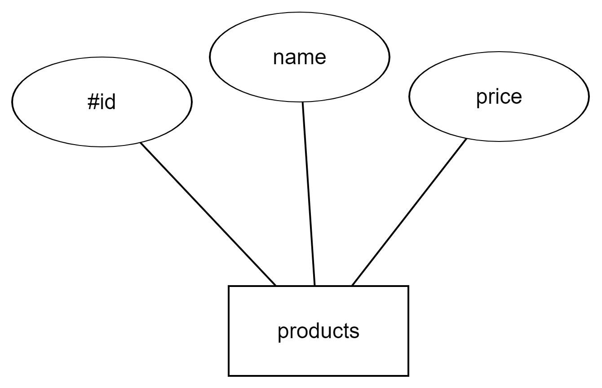
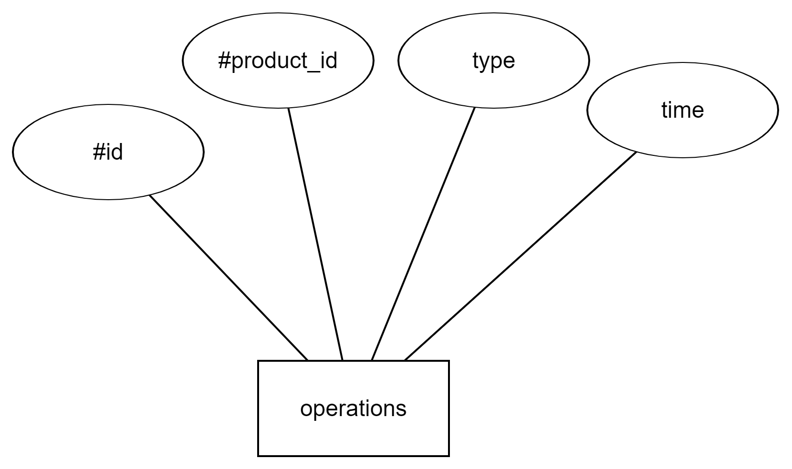
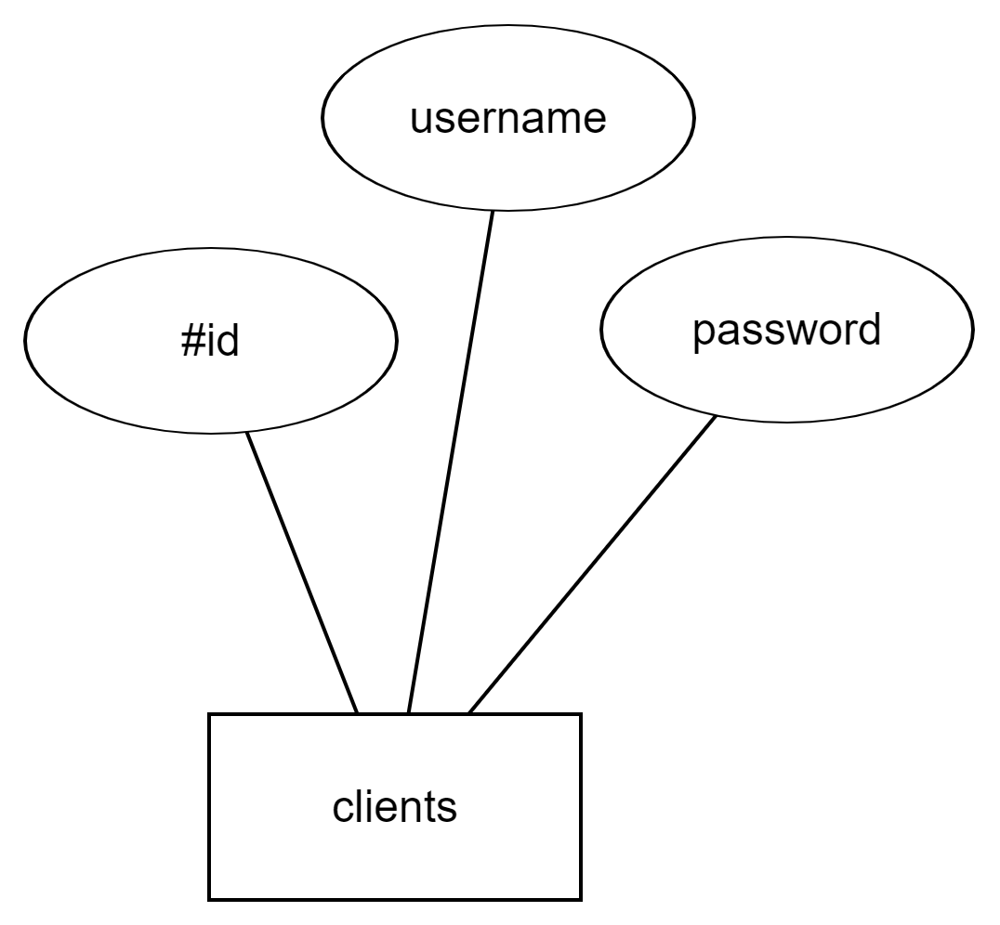
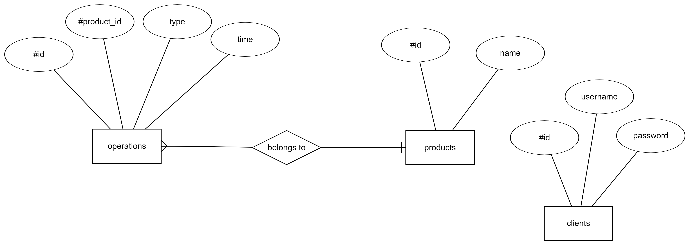

***[products](#products)***

***[operations](#operations)***

***[clients](#clients)***

***[chen-diagram](#chen-diagram)***

#  **products**
products(#id, name, price)

| field        | type           | extra description  |
| ------------- |:-------------:| -----:|
| id      | int(11) | primary key |
| name      | varchar(100)   |    |
| price | decimal(11, 2)      |     |

#  **operations**
operations(#id, products_id, type, time)

| field        | type           | extra description  |
| ------------- |:-------------:| -----:|
| id      | int(11) | primary key |
| product_id      | int(11)   |  foreign key   |
| type | varchar(20)      |     |
| time | bigint(20)      |     |

#  **clients**
clients(#id, username, password)

| field        | type           | extra description  |
| ------------- |:-------------:| -----:|
| id      | int(11) | primary key |
| username      | varchar(255)   |  |
| password | varchar(255)      |     |

#  **chen-diagram**

